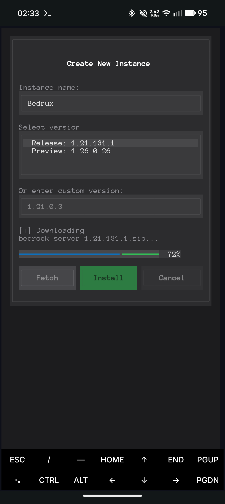
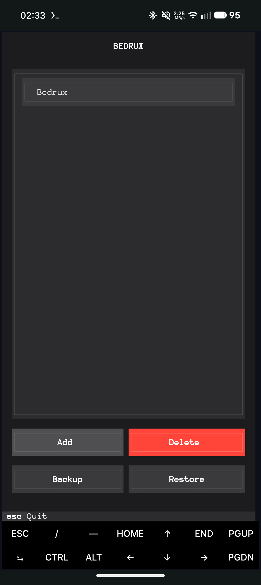
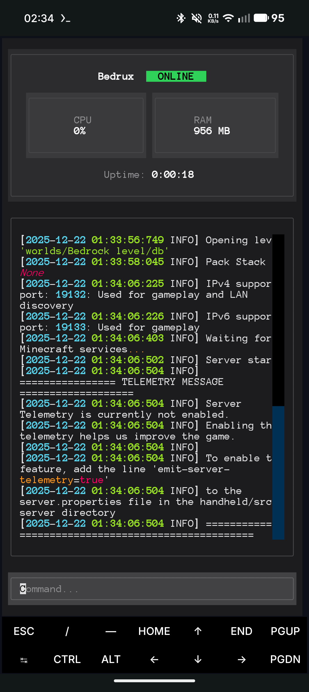

<div align="center">
  
  
  # 🎮 Bedrux v1.0.0
  
  ### **Minecraft Bedrock Dedicated Server on Android — Powered by Termux**
  
  [](https://github.com/theonuverse/bedrux)
  [](LICENSE)
  [](https://github.com/theonuverse/bedrux)
  
  <br>
  
  **🎉 Version 1.0.0 is here! Introducing the all-new Bedrux TUI — a beautiful, modern terminal interface for managing your Minecraft servers.**

</div>

---

## ✨ What's New in v1.0.0

| Feature | Description |
|---------|-------------|
| 🖥️ **Modern TUI** | Beautiful terminal user interface built with [Textual](https://textual.textualize.io/) |
| 📦 **One-Click Install** | Download and install any Bedrock server version with a single click |
| 💾 **Backup & Restore** | Create, manage, and restore server backups effortlessly |
| 📊 **Live Server Stats** | Real-time CPU, RAM, and uptime monitoring |
| 🎮 **Multi-Instance** | Run and manage multiple server instances |
| ⚡ **Auto Architecture Detection** | Seamless AMD64/ARM64 support with Box64 integration |

---

## 🚀 Features

- [x] **🖥️ Stunning Terminal UI** — Navigate with ease using the new Bedrux TUI
- [x] **📥 Smart Downloads** — Fetch latest release, preview, or any specific version
- [x] **💾 Backup System** — Create and restore server backups with timestamps
- [x] **🔄 Instance Management** — Create, delete, and switch between server instances
- [x] **📊 Real-time Monitoring** — Watch CPU, RAM usage, and server uptime live
- [x] **🏗️ Multi-Architecture** — Native AMD64 + ARM64 (via Box64) support
- [x] **⌨️ Interactive Console** — Send commands directly to your server
- [x] **🎯 Double-Click Actions** — Intuitive UI with click-to-start functionality

---

## ⚡ Quick Start

> [!IMPORTANT]
> **Requirements:** Download [Termux from F-Droid](https://f-droid.org/de/packages/com.termux/) (not Play Store version).

### 1️⃣ Install Bedrux Environment

Open Termux and run:

```bash
curl -L theonuverse.github.io/bedrux/setup | bash
```

### 2️⃣ Enter Bedrux Environment

```bash
pd sh bedrux
```

### 3️⃣ Launch Bedrux TUI

```bash
bedrux
```

**That's it! 🎉** You're now ready to create and manage your Minecraft Bedrock servers.

---

## 🎮 Using Bedrux TUI

<div align="center">
  <p>
    
    
    
  </p>
</div>

### Key Actions

| Key | Action |
|-----|--------|
| `S` | Start a server instance |
| `X` | Stop the server instance |
| `Esc` | Go back & Quit Bedrux |

### Server Console

Once your server is running, you can:
- 📝 Send commands directly (e.g., `say Hello!`, `stop`, `op <player>`)
- 📊 Monitor real-time stats (CPU, RAM, uptime)
- 📜 View live server logs

---

## 💡 Important Notes

### 🔧 ARM64 Compatibility

The Minecraft Bedrock Dedicated Server is built for AMD64 architecture. On ARM64 devices (most Android phones), Bedrux automatically uses [Box64](https://github.com/ptitSeb/box64) for translation.

> [!WARNING]
> **Performance varies by device.** ARM64 emulation may cause reduced performance compared to native AMD64. For best results, use a device with at least 4GB RAM.

> [!WARNING]
> **CPU monitor unavailable on Termux:** Termux does not expose per-process CPU usage to unprivileged apps. As a result, Bedrux's live CPU monitor will be unavailable or show inaccurate values when running inside Termux environments. RAM, uptime, logs and server management features still function normally.

### 📂 Data Storage

Bedrux stores all data in `~/.bedrux/`:
- `instances/` — Your server installations
- `backups/` — Server backups (timestamped `.zip` files)

---

## 🌟 Why Bedrux?

<table>
<tr>
<td width="50%">

### 🎯 **Simple**
One command to install, one command to run. No complex setup required.

### 🔒 **Your Server, Your Rules**
Full control over your Minecraft world — no third-party hosting needed.

</td>
<td width="50%">

### 📱 **Portable**
Run a Bedrock server anywhere your Android phone goes.

### 💰 **Free Forever**
No subscriptions, no hidden costs. Open source and community-driven.

</td>
</tr>
</table>

---

## 🛠️ Troubleshooting

<details>
<summary><b>Server won't start (Exit code 126)</b></summary>

This usually means the server binary isn't executable. Bedrux v1.0.0 fixes this automatically, but if it persists:
```bash
chmod +x ~/.bedrux/instances/<your-server>/bedrock_server
```
</details>

<details>
<summary><b>Download fails or times out</b></summary>

Check your internet connection. Bedrux downloads directly from Minecraft's official servers, which may be slow in some regions.
</details>

<details>
<summary><b>High CPU usage on ARM64</b></summary>

This is expected due to Box64 translation. Consider reducing view distance and simulation distance in `server.properties`.
</details>

---

## 📚 Additional Resources

- 📖 [Termux Wiki](https://wiki.termux.com/wiki/Main_Page)
- 🔧 [Box64 GitHub](https://github.com/ptitSeb/box64)
- 🎮 [Minecraft Bedrock Server Download](https://www.minecraft.net/download/server/bedrock)
- 📝 [Bedrock Server Properties Guide](https://minecraft.wiki/w/Server.properties#Bedrock_Edition)

---

<div align="center">

## ❓ Need Help?

**For questions, bugs, or feature requests, please [open an issue](https://github.com/theonuverse/bedrux/issues).**

I'm here to help! 💜

---

Made with 💜 by [theonuverse](https://github.com/theonuverse)

**⭐ Star this repo if Bedrux helped you!**

</div>
